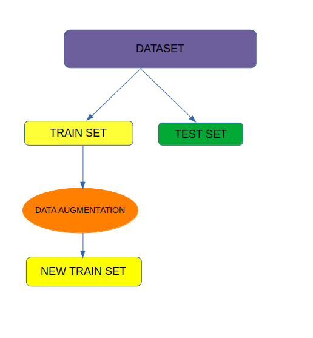
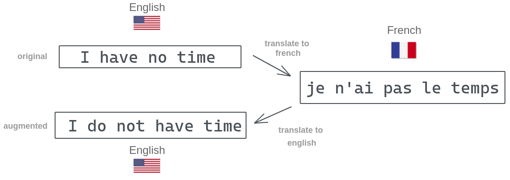
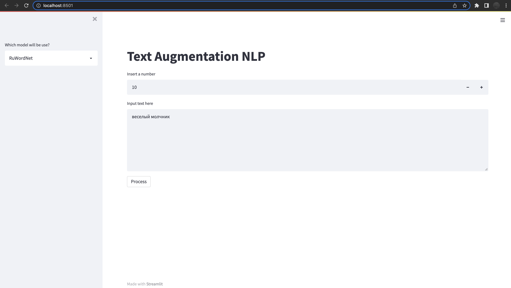

# Text Augmentation data for NLP


Data augmentation techniques are used to generate additional, synthetic data using the data you have. Augmentation methods are super popular in computer vision applications but they are just as powerful for NLP. 



### Back translation

In this method, we translate the text data to some language and then translate it back to the original language. This can help to generate textual data with different words while preserving the context of the text data. 



### Synonym Replacement

Randomly choose n words from the sentence that are not stop words. Replace each of these words with one of its synonyms chosen at random. 

Dependencies:
  + streamlit
  + spacy
  + ruwordnet
  + deep_translator
  + pymorphy2


How to run web application:
```python
# streamlit run app.py
```


